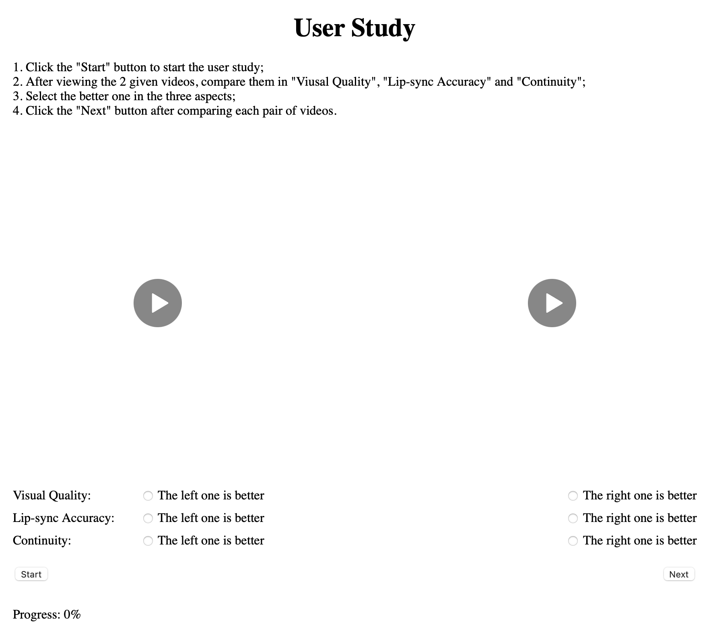

# User Study Tool for Talking Video AB Compare

## Requirements:

- Python 3.x
- Node.js

## Preview

## Where to Put Videos:

- The folder `Our` and `Other` should contain videos generated by our method and other method, respectively.
- The compared video pairs should have the same file name. The video name list should be written in `function.js`.
- The server IP/address should be written in `url` of `function.js`.

## What to Compare:

- Visual Quality
- Lip-Sync Accuracy
- Continuity

You can also edit `index.html` or `index_en.html` to customize the compared items.

## Usage:

- Server: Run `node app.js` to listen the port 9000 about the data of user study results. The results are saved in the file `results.txt`.
- Client: Run `index.html` (Chines) or `index_en.html` (English) to conduct the user study.

